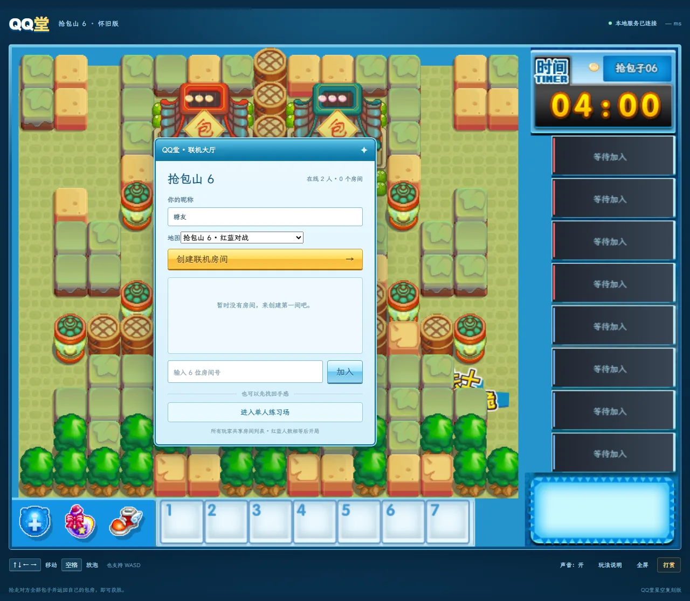
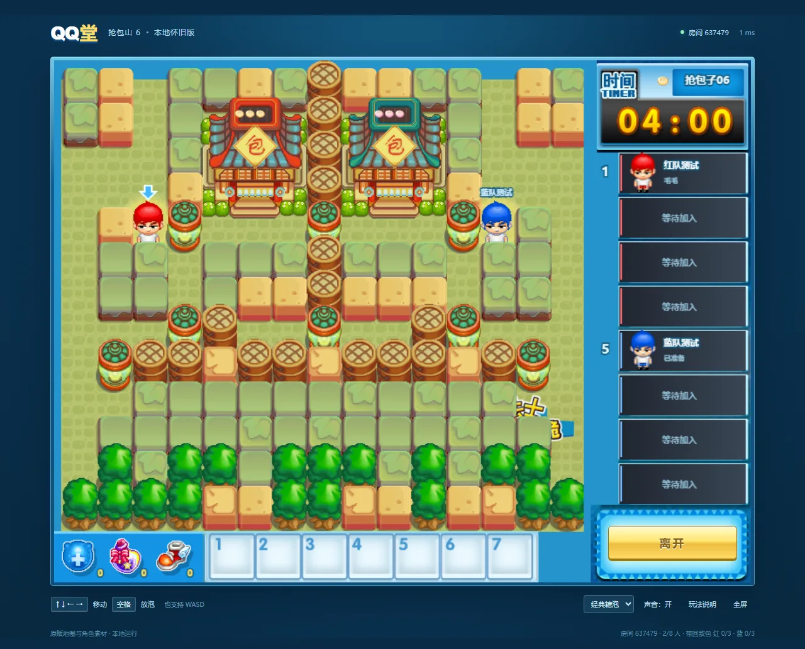
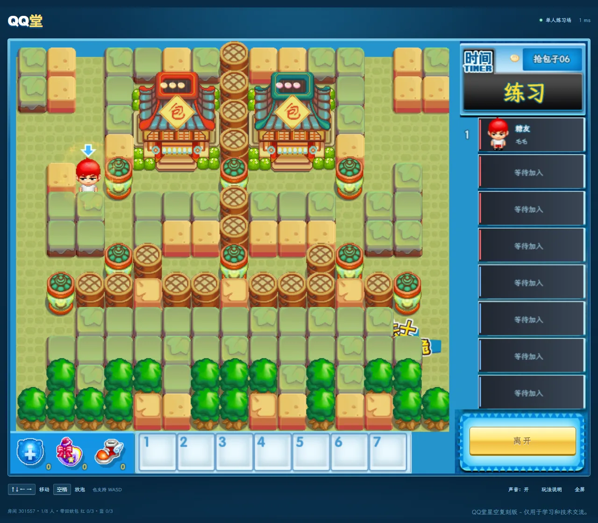
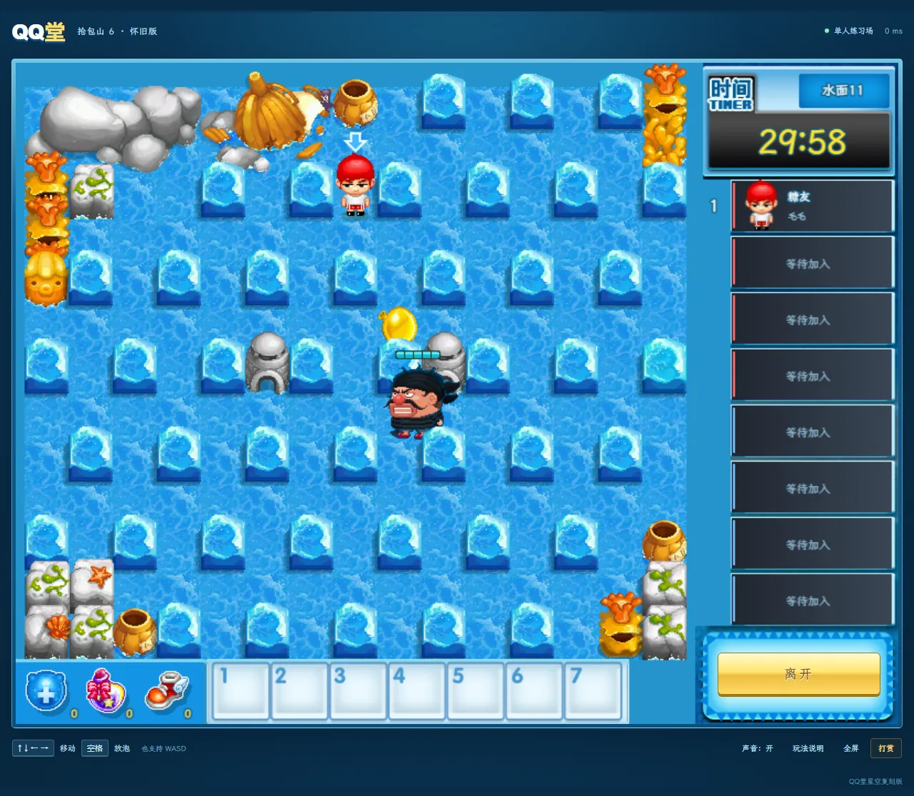
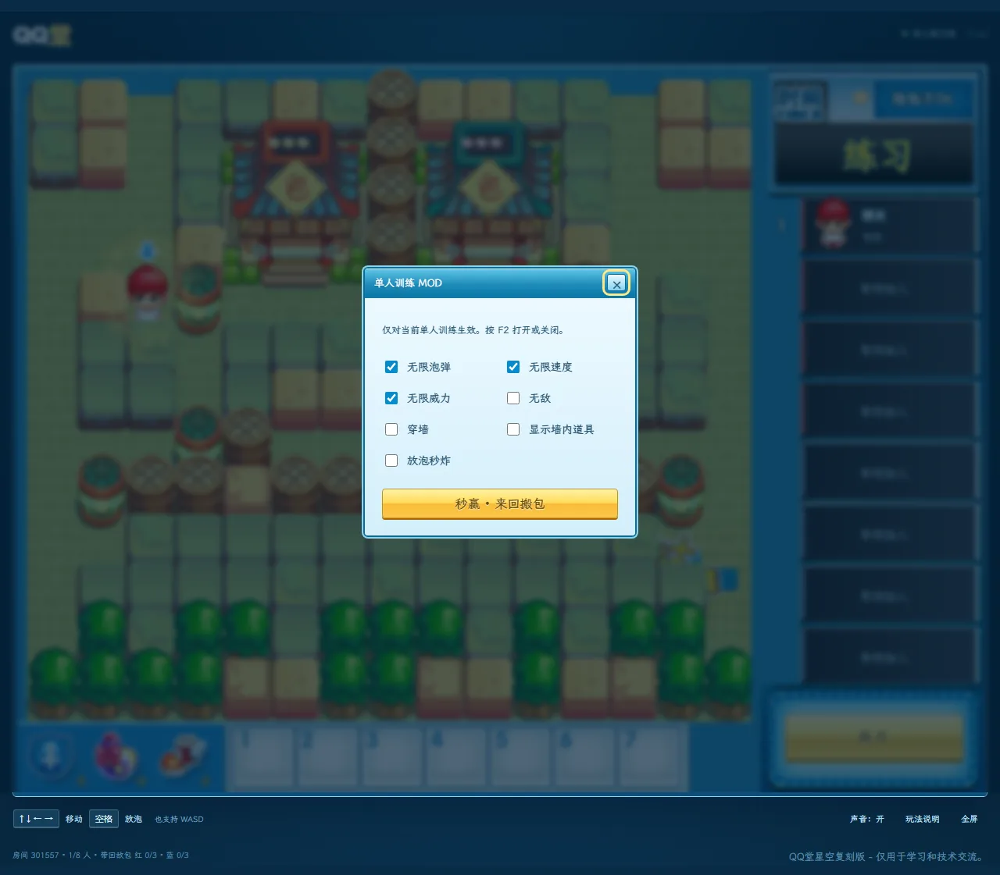

<div align="center">

# QQ堂· 星空复刻版

**《QQ堂》经典玩法「抢包山 6 和 水面11」的网页复刻 —— 浏览器打开即玩，支持 2–8 人实时联机**

[](https://nodejs.org)
[](test/)
[](LICENSE)
[](package.json)



</div>

---

## ⚠️ 免责声明

> 本项目是**非商业性质的同人技术复刻**，仅供**学习与技术交流**使用。

- 《QQ堂》及其美术、音频、字体素材的**著作权归腾讯公司所有**。本项目与腾讯**无任何关联**，未获其授权、认可或赞助。
- `public/assets/` 下的素材取自原版客户端文件，**不适用**本项目的代码开源许可，详见[素材与许可](#素材与许可)。
- 本项目**不含任何广告、打赏、付费或商业功能**。
- 若权利人认为本项目侵犯其权益，请提 [Issue](https://github.com/Ker0el/qqt-bun6/issues) 联系，将**立即删除**相关素材或整个仓库。

**请勿将本项目用于任何商业用途。**

---

## 目录

- [这是什么](#这是什么)
- [截图](#截图)
- [玩法规则](#玩法规则)
- [特色功能](#特色功能)
- [快速开始](#快速开始)
- [项目结构](#项目结构)
- [技术实现](#技术实现)
- [测试](#测试)
- [部署](#部署)
- [已知边界](#已知边界)
- [素材与许可](#素材与许可)
- [参考资料](#参考资料)
- [贡献者](#贡献者)

---

## 这是什么

《QQ堂》是腾讯 2004 年上线的休闲竞技网游，已于 2022 年 4 月停服。「抢包山」是其经典玩法之一：双方各守住一间包子房，进入对方房内夺取包子并背回自家即得分，先抢齐对方全部包子的一方获胜。

**抢包山 6** 是该玩法的经典地图。本项目把它完整重制成了网页版：

- **纯浏览器运行** —— 前端原生 Canvas，无任何前端框架与构建步骤
- **服务端权威** —— 所有移动、放泡、判定、AI 全部跑在 Node 服务端，客户端只负责渲染与输入
- **开箱即玩** —— 素材已全部内置，`npm ci && npm start` 即可，无需自备游戏文件
- **完整还原手感** —— 糖泡引信、被困营救、背包减速、**穿泡穿墙**等原版机制

---

## 截图

<table>
<tr>
<td width="50%"><br><div align="center"><sub><b>红蓝两军对垒</b> —— 2–8 人实时联机，双方人数相等且准备后开局</sub></div></td>
<td width="50%"><br><div align="center"><sub><b>单人练习场</b> —— 自由练习走位、放泡与抢包，不展示在公共大厅</sub></div></td>
</tr>
<tr>
<td width="50%"><br><div align="center"><sub><b>水面 11（PVE）</b> —— 1–5 人合作，击败海盗水手，十帧血条挂在头顶</sub></div></td>
<td width="50%"><br><div align="center"><sub><b>训练 MOD</b> —— 按 F2 呼出，无限泡弹 / 速度 / 威力 / 无敌 / 穿墙 / 秒炸</sub></div></td>
</tr>
</table>

---

## 玩法规则

每队固定三个包子。**把对方三个包子带回自己房内即可获胜**，不要求自己的包子全都在家。限时 4 分钟。

| 机制 | 实现 |
|---|---|
| 糖泡 | 约 3 秒引爆，炸开砖块并覆盖十字范围 |
| 被困 | 被泡困住后队友可接触营救，敌人接触则击破；阵亡 10 秒后复活 |
| 背包 | 背包子时减速，且**不能放泡**；掉包后须重新拾取背回 |
| 包子房 | 四角有碰撞并挡火，中间十字通道可进出，房内也能被炸到 |
| 道具 | 提升泡数 / 威力 / 速度；叉子、香蕉皮、笑脸按 `1` / `2` / `3` 使用 |
| 爆炸判定 | 按瞬间覆盖判伤，**恰好半身不命中**；残留火焰动画不重复判伤 |

### 穿技

原版玩家社群发展出的高阶技巧：在特定时机放泡，可以穿过泡弹甚至墙体。

实现按「面向目标的短按 / 持续接近 / 助跑」建立穿泡节奏，约 **0.6 秒**时放泡，当前容错窗口为 **0.42–0.82 秒**。穿势持续时间随移动速度变化。

> 这是按玩家教程与手感反馈**放宽**的设置，**不是**声称已经逐帧复现原版判定。校准记录见 [`REFERENCES.md`](REFERENCES.md)。

---

## 特色功能

**🎮 联机对战**
服务端权威模拟，2–8 名真人；大厅实时展示公开房间与人数，可直接加入。房主开局，双人人数相等且其余玩家准备后开始。

**🧱 穿泡穿墙**
穿入墙格后进入独立前景绘制层，留在墙内时保持置顶，回到地面恢复正常遮挡。静态障碍边缘可自动滑动，对泡弹不做自动横向吸附。

**🛠 单人训练 MOD**
按 <kbd>F2</kbd> 呼出：无限泡弹 · 无限速度 · 无限威力 · 无敌 · 穿墙 · 显示墙内道具 · 放泡秒炸 · 秒赢演示。

> 全部由**服务端强制限制为单人训练**：公开联机房间会拒绝训练指令，隐藏道具位置也不会随普通对局快照下发。

**🌊 水面 11（PVE 合作）**
1–5 人同队合作，击败海盗水手获胜。水手会寻路、放泡、投掷减速胶，并撒下笑脸陷阱；洞口可藏身，踩到香蕉皮能解除减速。详见 [`WATER11.md`](WATER11.md)。

**💬 房间聊天**
<kbd>Enter</kbd> 打开聊天，再按发送，<kbd>Esc</kbd> 收起。未进房时发到大厅，进房后仅发到当前房间。

---

## 快速开始

需要 **Node.js 22 或更高版本**。

```bash
npm ci --omit=dev --ignore-scripts
npm start
```

然后打开 <http://localhost:8787>。

<details>
<summary><b>Windows 一键启动</b></summary>

双击仓库根目录的 `启动游戏.cmd`，结束后运行 `停止游戏.cmd`。

</details>

<details>
<summary><b>局域网联机</b></summary>

同一局域网内，其他设备访问**房主电脑的局域网地址 + `:8787`**（游戏内「玩法说明」里会显示该地址）。

</details>

<details>
<summary><b>声音不响？</b></summary>

受浏览器自动播放策略限制，需要**先点击一次页面**才会真正出声。声音可在下方工具栏开关。

</details>

---

## 项目结构

```
qqt-web/
├── server.mjs              # HTTP + WebSocket 服务端入口
├── public/
│   ├── index.html          # 页面骨架与各弹窗
│   ├── app.mjs             # 客户端主逻辑：输入、渲染、网络、UI
│   ├── engine.mjs          # 渲染引擎：地图、角色、泡弹、火焰动画
│   ├── water11.mjs         # 水面 11 PVE 专用渲染
│   ├── style.css           # 主样式（压缩单行）
│   ├── extras.css          # 补充样式（未压缩，一行一个选择器）
│   └── assets/             # 图块、角色、音效、字体
├── test/                   # 逻辑测试 + 浏览器端到端测试
├── tools/                  # 素材导入与处理脚本
├── docs/screenshots/       # README 截图
├── deploy/                 # Caddy 反向代理配置
├── NOTICE.md               # 素材授权例外说明（重要）
└── WATER11.md              # 水面 11 实现记录与调参说明
```

---

## 技术实现

**服务端权威架构。** 客户端只上报输入，服务端模拟一切并下发快照。这避免了作弊，也让穿泡判定在所有客户端上完全一致 —— 对一款吃帧数的竞技游戏来说这是必须的。

| 层 | 实现 |
|---|---|
| 服务端 | Node.js 原生 `http` + [`ws`](https://github.com/websockets/ws)，单进程内存态房间 |
| 前端 | 原生 ES Module + Canvas 2D，**零框架、零构建步骤** |
| 通信 | WebSocket 增量快照，含消息频率限制、包大小限制与连接心跳 |
| 测试 | Node 内置 `node:test` + Playwright 驱动的浏览器端到端断言 |

几个值得一提的细节：

- **恒定值只发一次** —— 陷阱时长、砖块布局这类整局不变的数据只在首帧下发，客户端据此反推破泡动画进度；两边不一致会导致动画直接跳帧。
- **图集帧号即血量** —— 水手血条按原版十帧素材绘制，帧号 = 血量 − 1，锚定格点而非动画帧，走动不抖。
- **素材导入可复现** —— `tools/` 下的脚本从原版客户端数据文件解析地图、图块与角色分层，导入过程留有审计记录（[`ASSET-AUDIT.md`](ASSET-AUDIT.md)）。

---

## 测试

```bash
npm test
```

运行 **89 项**逻辑、房间、聊天、引擎与训练权限测试，全部通过。

浏览器端到端测试需先启动本地服务，并使用本机已安装的 Chrome：

```bash
node test/browser-smoke.mjs      # 基础加载与开局
node test/browser-training.mjs   # 训练 MOD 开关
node test/browser-extras.mjs     # 附加界面
node test/browser-water11.mjs    # 水面 11：素材、开局、血条位置、洞口点亮
```

> 浏览器测试用画布取样做断言（例如比对血条底板色 `#303430` 是否出现在水手头顶），不只是检查元素存在。

---

## 部署

单机自托管，需要一台支持 Docker Compose 的 Linux 服务器、一个域名，以及可访问的 TCP 80/443。

```bash
cp .env.example .env     # 把 GAME_DOMAIN 改成你自己的域名
docker compose up -d --build
```

Caddy 负责自动 HTTPS 与 WebSocket 反向代理，应用端口 8787 只在容器网络内可见。详细说明见 [`DEPLOY.md`](DEPLOY.md)。

**架构约束**：大厅与房间保存在**单个服务进程内**，重启会结束现有对局。目前不做多实例扩容与跨实例房间分配。

---

## 已知边界

这是个**持续校准中的复刻开发版**，不是完成品。以下几项尚未完成，欢迎 PR：

- **穿技未覆盖全部变体** —— 完整 2P、侧穿、擦墙、相邻泡/墙等条件仍在验证中。
- **未做逐帧一致性验证** —— 移动速度、碰撞范围、转向偏移需以最终版客户端录像为基准测量。
- **水面 11 的 AI 是服务端重建实现**，非移植原客户端 AI；寻路与放泡节奏尚未经过真人对战校准。
- **原版有而本项目尚未实现** —— 房间密码、踢人、翻页、显示所有房间、随机加入、独立玩家列表、地图选择、房间模式（标准/自由）。
- **网络层** —— 公网高延迟下的移动预测、重连续局与长时间压力测试仍需完成。

参考资料的参数存在版本冲突（腾讯官方说明 vs 玩家实测 vs 逆向记录），取舍理由逐条记录在 [`REFERENCES.md`](REFERENCES.md)。

---

## 素材与许可

本项目**代码与素材采用不同的授权**，请分别对待。完整说明见 [`NOTICE.md`](NOTICE.md)。

### 代码 —— MIT

服务端、客户端脚本、样式、测试与工具脚本（即 `public/assets/` 以外的全部内容）以 [MIT 许可证](LICENSE) 开源，可自由使用、修改、分发。

### 素材 —— 不适用 MIT，权属腾讯

`public/assets/` 下的全部美术、音频与字体（图块、角色精灵、UI 元素、音效、`match.ogg`、字体文件等）均**提取自原版《QQ堂》客户端**，**著作权归腾讯公司所有**。

这些素材**不在 MIT 许可范围内**，本项目对其不作任何权利主张，仅为**学习与技术交流**目的随源码一并提供。请勿将其用于任何其他用途。

本项目**不附带**原版客户端文件；`tools/` 下的导入脚本仅用于从**你自备的**客户端数据文件中提取素材。

---

## 参考资料

机制参数并非凭空设定，每条都标注了出处、可信度与版本差异，完整记录见 [`REFERENCES.md`](REFERENCES.md)：

- [QQ堂穿技理论知识](https://zhuanlan.zhihu.com/p/65124408) —— 激活、约 0.55–0.65 秒计时、穿势持续与偏位说明（玩家研究，非官方参数表）
- [触乐：他们与《QQ堂》](https://www.chuapp.com/mobile/288679.html) —— 停服后对穿技玩家与《果糖》开发者的采访
- [腾讯 QQ 游戏玩法介绍](https://qqgame.qq.com/app/gamedetail_10378.shtml) —— 糖泡引爆与困泡死亡时长
- [QQ堂怀念版](https://qqt.95hyc.cn/) —— 历史版本与界面参考

---

## 贡献者

| | 贡献 |
|---|---|
| **Ker0el** | 项目发起 · 玩法规则与手感校准 · 原版素材整理 · 地图与角色还原 |
| **Claude Code** | 素材导入管线（DIMG 解码、图集生成）· 水面 11 PVE 与训练 MOD · 服务端模拟与联机 · 测试与文档 |

本项目在 [Claude Code](https://claude.com/claude-code) 协助下开发。

---

<div align="center">
<sub>

**本项目仅供学习与技术交流，与腾讯公司无任何关联。**

如果这个项目让你想起了当年在网吧抢包山的下午 —— 那就够了。

</sub>
</div>
